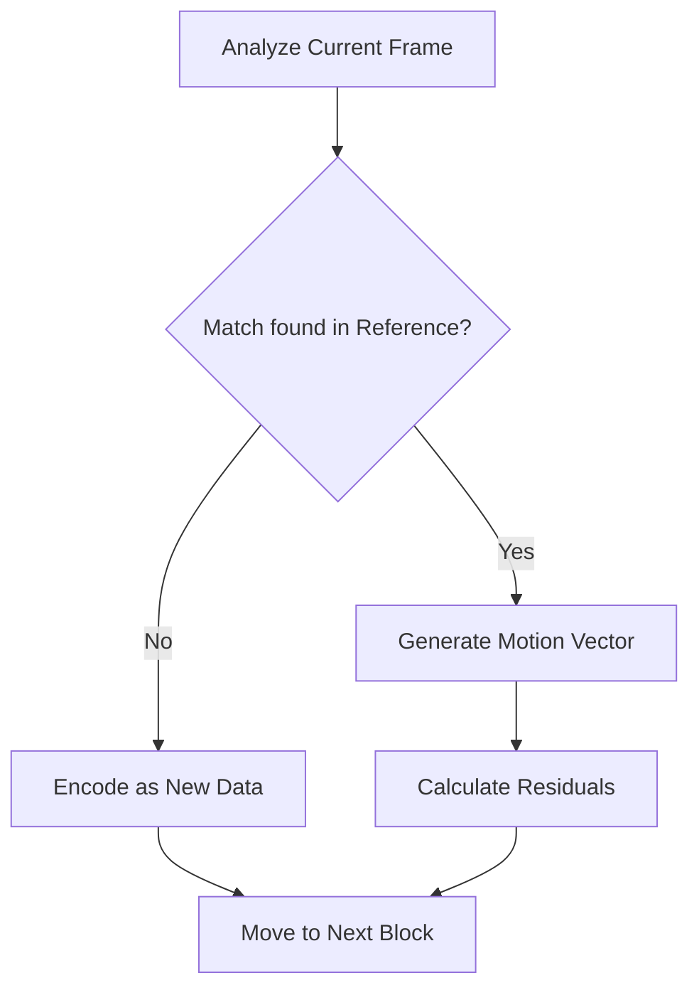

## Introduction

In the world of digital media, high-definition video files are naturally massive. Without efficient compression, streaming a 4K movie would be nearly impossible for most internet connections. **Motion compensation** is a cornerstone technology in video compression (used in standards like H.264, HEVC, and AV1) that drastically reduces file size by exploiting the temporal redundancy between video frames.

Instead of treating every frame as a brand-new image, motion compensation describes how objects move from one frame to the next. By only recording the "changes" or the "motion vectors" rather than the entire pixel grid, we can maintain high visual quality at a fraction of the data cost.

---

## How Motion Compensation Works

The process relies on the fact that in most videos, much of the background or the objects remain the same between frames, just in slightly different positions.

### 1. Frame Types

To understand motion compensation, we categorize frames into three main types:

* **I-Frames (Intra-coded):** Complete images (like a JPEG). They serve as the reference point.
* **P-Frames (Predicted):** These look backward to the previous frame and only store the differences.
* **B-Frames (Bi-predictive):** These look both backward and forward to calculate motion, offering the highest compression.

### 2. Block-Matching Algorithm

The encoder divides a frame into blocks (often called macroblocks). It then searches the previous frame to find a similar block of pixels.

* **Motion Vector:** If a match is found, the encoder simply records a "motion vector"—a small piece of data saying "this block moved 5 pixels left and 2 pixels up."
* **Residuals:** Any tiny differences between the original block and the predicted block are stored as "residual" data.

### 3. The Process Flow

The logic behind determining if a frame is successfully compensated can be visualized through this simplified debugging and refinement loop:

---

## The Role of Motion Compensation

The primary role of motion compensation is **efficiency**. By focusing on movement rather than static imagery, it allows for:

* **Reduced Bandwidth:** It enables smooth streaming on platforms like YouTube and Netflix.
* **Storage Savings:** It allows high-quality video to fit on discs and hard drives.
* **Real-time Communication:** It is essential for low-latency video calls (Zoom, FaceTime) where data must be transmitted instantly.

Without motion compensation, the digital video revolution would have stalled, as the sheer volume of raw pixel data would overwhelm our modern networks.

---

**Would you like me to expand on the differences between Global and Block-based motion compensation?**
